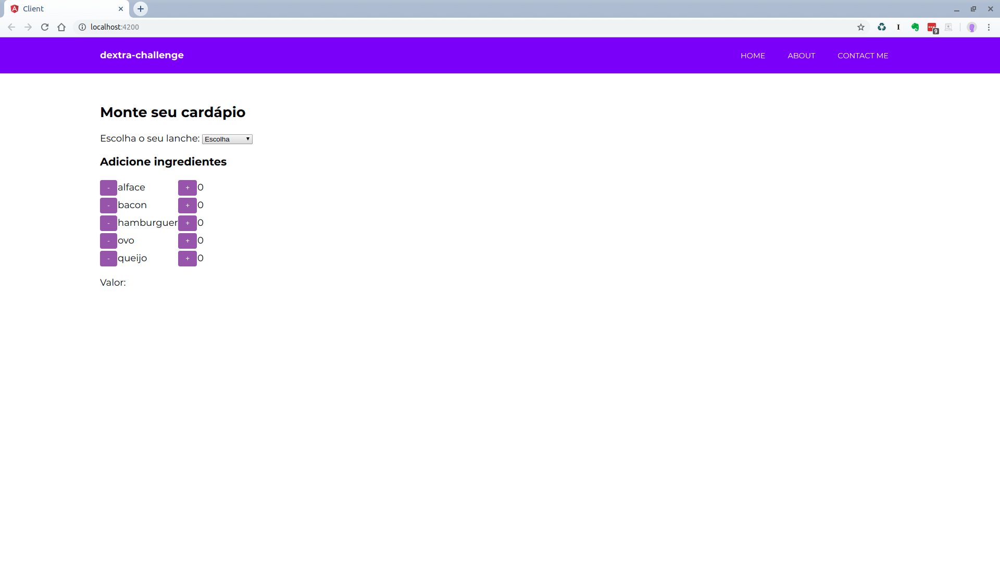

# dextra-challenge

## Descrição:

Somos uma startup do ramo de alimentos e precisamos de uma aplicação web para gerir nosso negócio. Nossa especialidade é a venda de lanches, de modo que alguns lanches são opções de cardápio e outros podem conter ingredientes personalizados.

A seguir, apresentamos a lista de ingredientes disponíveis:

| Ingrediente         | valor   |
| --------------------|---------|
| Alface              | R$ 0,40 |
| Bacon               | R$ 2,00 |
| Hamburguer de Carne | R$ 3,00 |
| Ovo                 | R$ 0,80 |
| Queijo              | R$ 1,50 |

Segue as opções de cardápio e seus respectivos ingredientes:

| Lanche      | Ingredientes                             |
| ------------|------------------------------------------|
| X-Bacon     | Bacon, hambúrguer de carne e queijo      |
| X-Burger    | Hambúrguer de carne e queijo             |
| X-Egg       | Ovo, hambúrguer de carne e queijo        |
| X-Egg Bacon | Ovo, bacon, hambúrguer de carne e queijo |

O valor de cada opção do cardápio é dado pela soma dos ingredientes que compõem o lanche. Além destas opções, o cliente pode personalizar seu lanche e escolher os ingredientes que desejar. Nesse caso, o preço do lanche também será calculado pela soma dos ingredientes.

Existe uma exceção à regra para o cálculo de preço, quando o lanche pertencer à uma promoção. A seguir, apresentamos a lista de promoções e suas respectivas regras de negócio:

| PROMOÇÃO      | REGRA DE NEGÓCIO                             |
| ------------|------------------------------------------|
| Light     | Se o lanche tem alface e não tem bacon, ganha 10% de desconto.      |
| Muita carne    | A cada 3 porções de carne o cliente só paga 2. Se o lanche tiver 6 porções, ocliente pagará 4. Assim por diante...  |
| Muito queijo       | A cada 3 porções de queijo o cliente só paga 2. Se o lanche tiver 6 porções, ocliente pagará 4. Assim por diante...        |
| Inflação | Os valores dos ingredientes são alterados com frequência e não gastaríamos que isso influenciasse nos testes automatizados. |

## Módulos utilizados

* @angular-cli
* chai
* cors
* eslint
* express
* istanbul
* mocha
* nock
* request 
* request-promise

## Considerações

Os builds são testados por integração com o Codeship

## Como rodar:

### Com docker

**Pré-requisito:** Ter o docker instalado na máquina

#### Server

1 - Clone o repositório

`git clone https://github.com/marcioalexbarbosa/dextra-challenge.git`

2 - Entre no diretório dextra-challenge

`cd dextra-challenge`

3 - Faça build da imagem

`sudo docker build -t dextra-challenge .`

4 - Rode o container

`sudo docker run -p 3000:3000 -d dextra-challenge`

#### Client

1 - Entre no diretório client

`cd client`

2 - Faça build da imagem

`sudo docker build -t dextra-challenge-client .`

3 - Rode o container

`sudo docker run -it -v ${PWD}:/usr/src/app -v /usr/src/app/node_modules -p 4200:4200 --rm dextra-challenge-client`

4 - Abra uma aba do browser no endereço

`http://localhost:4200`

### Sem docker

**Pré-requisito:** Instalar a versão Latest LTS do node.js (10.15.3)

#### Server

1 - Clone o repositório

`git clone https://github.com/marcioalexbarbosa/dextra-challenge.git`

2 - Entre no diretório dextra-challenge

`cd dextra-challenge`

3 - Instale os módulos necessários

`npm install`

4 - Rode os testes

`npm run coverage`

5 - Inicie o server

`npm start`

#### Client

1 - Abra outro terminal e vá até o diretório do client

`cd dextra-challenge/client`

2 - Instale os módulos necessários

`npm install`

3 - Instale o Angular globalmente

`npm install @angular/cli -g`

4 - Rode os testes

`ng test`

5 - Rode o client

`npm start`

## Testes

1 - para rodar os testes do server

`npm test`

para rodar os testes de cobertura do server

`npm run coverage`

2 - para rodar os testes do client

```bash
cd client
ng test
```
## Screenshot


